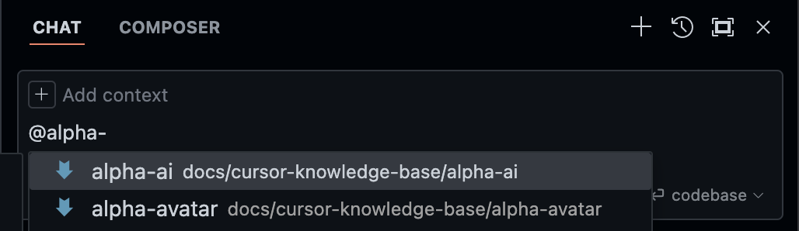

# Avatar AIPI + Cursor 

## Pre-requisites
- Git installed
- NPM installed
- Cursor installed
> Use GPT/Claude to walk through installing these if you need help

<br><br>
## Git Clone the Repository

> **DEV NOTE:** This first section is verbose incase the reader is not familiar with terminal commands. You can skip this if you are comfortable.
> - git clone `https://github.com/agencyenterprise/alpha-ai-avatar-sdk-react` 
> - (**required**) create a new aipi-application using the provided template 
> - `cd alpha-ai-avatar-sdk-react/aipi-applications` 
> - `cp -r aipi-application-template NEW_APP_DIR_NAME`
> - Open Cursor at the **MAIN REPO DIRECTORY** not your AIPI application directory.
> - You can then skip to the **Cursor x AIPI - Tools & Workflows** section._
---


<br><br>


### 1. Open the Terminal 
- Mac, press `⌘ + space` and type `terminal`. 
- Windows search for the application `Command Prompt`


<br>
<br>

### 2. Run this command in the terminal to download the AIPI kit
```bash
git clone https://github.com/agencyenterprise/alpha-ai-avatar-sdk-react
```

This command downloads a copy of the latest Alpha Avatar SDK & the latest AIPI tooling we've built around Avatar.  *If this command fails, paste the output into GPT/Claude and they will help you fix it no problem*

> Note: If you have a folder you usually put work documents in you can use the change-directory command (`cd`) before running the `git clone` command that downloads the codebase. For example: `cd ~/Documents` to save it in your documents folder. Also you can use the `pwd` command to know where the terminal is currently pointed at


<br>
<br>

### 3. Open Cursor
- Open Cursor, select "Open a folder", and select our new codebase
  - Most likely found here: `Users/YOUR_USERNAME/alpha-ai-avatar-sdk-aipi`  
  - If you can't find it, use command `pwd` in the terminal that you ran `git clone` in to find the path to the folder
- Enable Cursor's Terminal using `⌘ + J`

 

<br>
<br>

### 4. Create your first AIPI application:
For any application you build, you must start by first creating a copy (`cp`) of the provided `aipi-application-template`

In the terminal inside Cursor, run the following command. <br>
> **IMPORTANT: replace `YOUR_APP_NAME` with the name of your application, no spaces or special characters**)
```bash
cd aipi-applications && cp -r aipi-application-template YOUR_APP_NAME
```

<br>
<br>

### 5. Connecting your OpenAI API Key and Avatar API Key:
You will find a file called `.env` in your new application. `/aipi-applications/YOUR_APP_NAME/.env` and it will look like this:
```bash
REACT_APP_OPEN_AI_API_KEY=XXXXXXXXXXXXX
REACT_APP_ALPHA_AVATAR_API_KEY=XXXXXXXXXXXXX
```

Replace `XXXXXXXXXXXXX` with your actual OpenAI API Key and Avatar API Key before running the next step.

<br>
<br>

### 6. Run your website in the browser:
To run the website and make sure everything is working, we must first install the dependencies. 

In the terminal inside Cursor, run the following command: (`yarn` works too)
```bash
cd YOUR_APP_NAME && npm install
```

Then, start your app: 
```bash
npm run start
```

Now, open your browser to `http://localhost:3000` and you should see the template application! It will automatically open when you save any file.

Next, we will walk through different ways to use Cursor to build applications and how to use the AIPI tools we've provided.


<br><br><br>
<br><br><br>
---

<br><br><br>
<br><br><br>


# Cursor x AIPI - Tools & Workflows
We created this list from our experience of the most useful features of Cursor when creating applications with AIPI. Ordered in terms of efficiency and ease of use when it comes to the AI's ability to understand and generate code accurately.

<br><br>

### Generating Code with Composer (`cmd + I`)
- You want to start each chat with the context to make sure the AI produces the best results:
  - Start with `@alpha-avatar` for any Avatar functionality/questions
  - Start with `@alpha-ai` to include the AI functionality in your website
  - Start with `@your-application-name` to include your entire application
    - you can include multiple `@` when prompting

- You can search other aipi tools by typing `@alpha-` and viewing the list
 
> If adding other libraries, its reccomended for indexing to using the `alpha-` naming pattern and placing inside the folder: `/docs/cursor-knowledge-base/alpha-<library-name>`

### Cursor Hotkeys:
- `CMD + I` Opens composer
  - You can highlight text and then press `CMD + I` to include context, or at the top of the file you can add any file you specifically want to include as context

- `CMD + R` - Clear the Composer history

- `CMD + SHIFT + I` - Opens larger composer window 


<br><br><br>

# Example workflows:
- Creating a basic single file application with Avatar 
- Creating a UI component to use in your application
- Creating AI-powered feature in your application
- Multiple page application 
- Saving data to users computer (local storage)

<br><br><br>
# Misc Tips 
- You don't need to accept changes before previewing, just use `control + s` to save and then you can see if it worked.. then Accept/Reject changes

